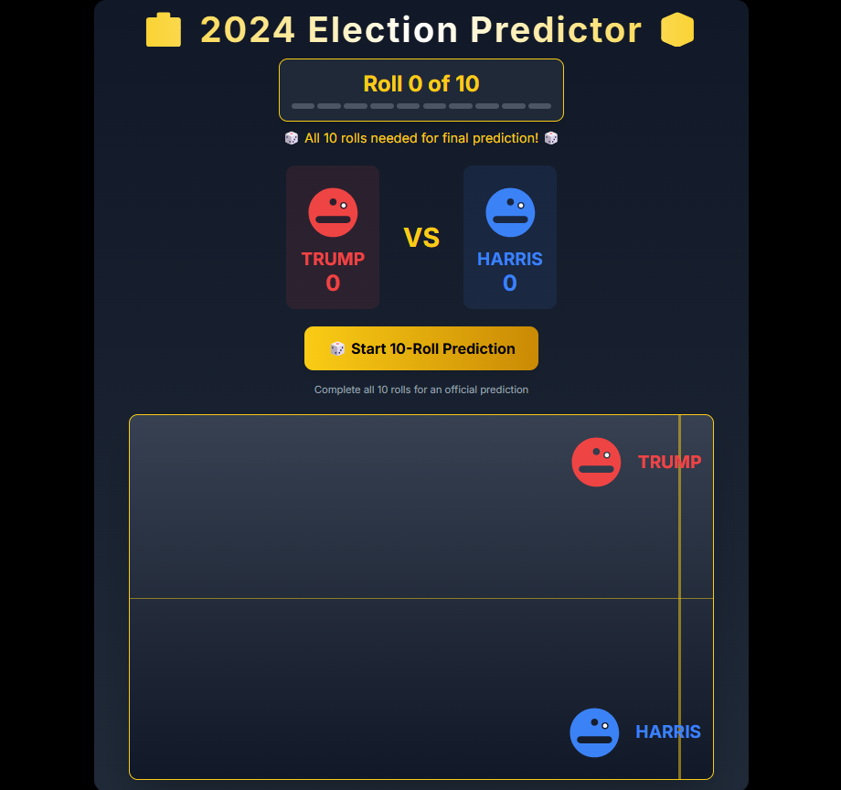

# [2024 Election Predictor 🗳️](https://election-predictor-2024-ten.vercel.app/)

A fun and interactive way to "predict" the 2024 US Presidential Election through random chance visualization. This project is built with Next.js, TypeScript, and Tailwind CSS.



## 🎮 How It Works

- A bouncing ballot traverses from left to right with random vertical movements
- The screen is divided into two territories: Trump (top) and Harris (bottom)
- Each prediction requires 10 complete rolls
- The final territory where the ballot lands counts as a prediction for that candidate
- After 10 rolls, a final winner is declared based on majority predictions

## 🚀 Features

- Real-time animated predictions
- Visual trail showing the ballot's path
- Progress tracking for 10-roll sets
- Dynamic score counting
- Responsive design
- Vibrant UI with political party mascots
- Engaging animations and transitions

## 🛠️ Tech Stack

- Next.js 14
- TypeScript
- Tailwind CSS
- React Hooks
- Modern Animation Techniques

## 🚀 Try It Out

Visit the live demo: [2024 Election Predictor](https://election-predictor-2024-ten.vercel.app/)

## 🧑‍💻 Local Development

1. Clone the repository:
```bash
git clone https://github.com/tony-42069/election-predictor-2024.git
